<p align="center">
   
</p>

<p align="center">	
   <a href="https://www.linkedin.com/in/pablo-rosa-68136a1b2/">
      
   </a>
  

  <a href="https://github.com/PabloRSantos/MercadoLivre/commits/master">
    
</p>

> :rocket: Projeto feito para treinar banco de dados e socket IO


<div align="center">
  <p>Feito com ❤︎ por
    <a href="https://github.com/PabloRSantos">Pablo Rosa</a>
  </p>
</div>


# :pushpin: Índice

- [Sobre](#sobre)
- [Tecnologias Utilizadas](#tecnologias-utilizadas)
- [Como Usar](#como-usar)
- [Como Contribuir](#como-contribuir)

<a id="sobre"></a>

## :bookmark: Sobre

o <strong>Mercado Livre</strong> é uma aplicação Web para você vender e comprar produtos, como o original mercado livre


<a id="tecnologias-utilizadas"></a>

## :rocket: Tecnologias Utilizadas

O projeto foi desenvolvido utilizando as seguintes tecnologias

- [Javascript](https://www.javascript.com/)
- [Node.js](https://nodejs.org/en/)
- [ReactJS](https://reactjs.org/)
- [Socket IO](https://socket.io)
- [Postgress](https://www.postgresql.org)
- [Knex](http://knexjs.org)

## :heavy_check_mark: :computer: Resultado Web


<h1 align="center">
    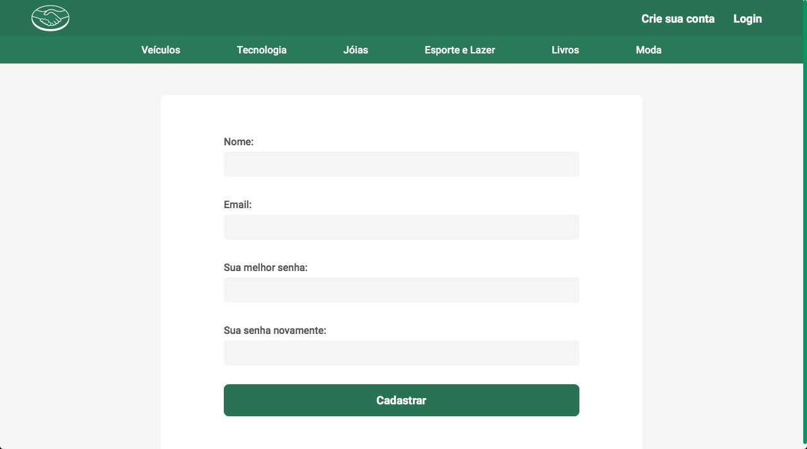
    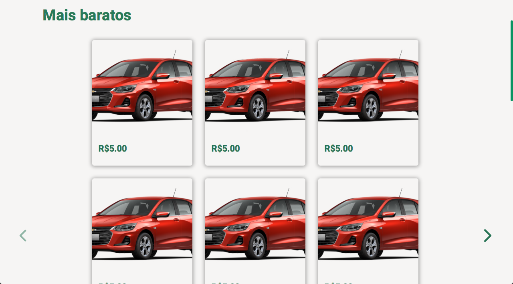
        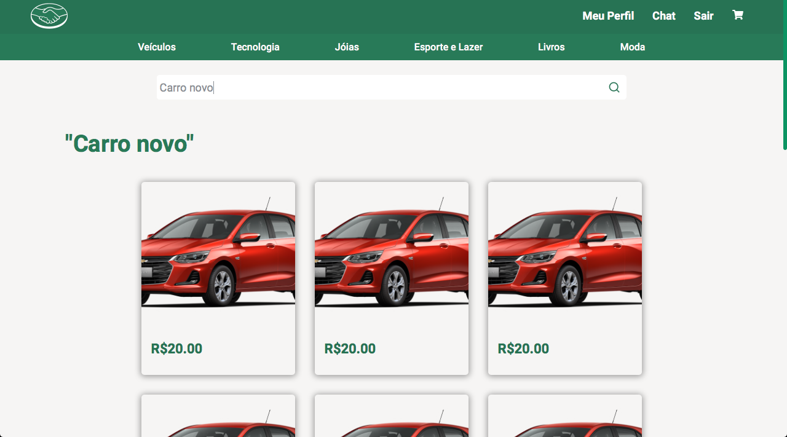
    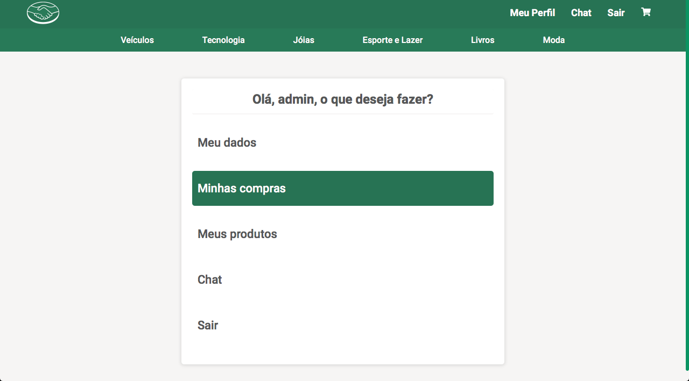
    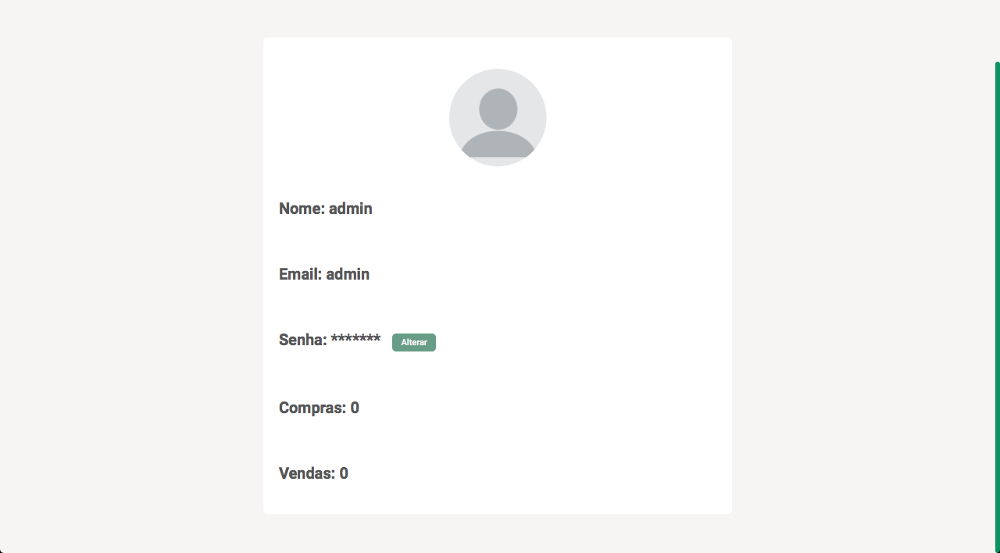
    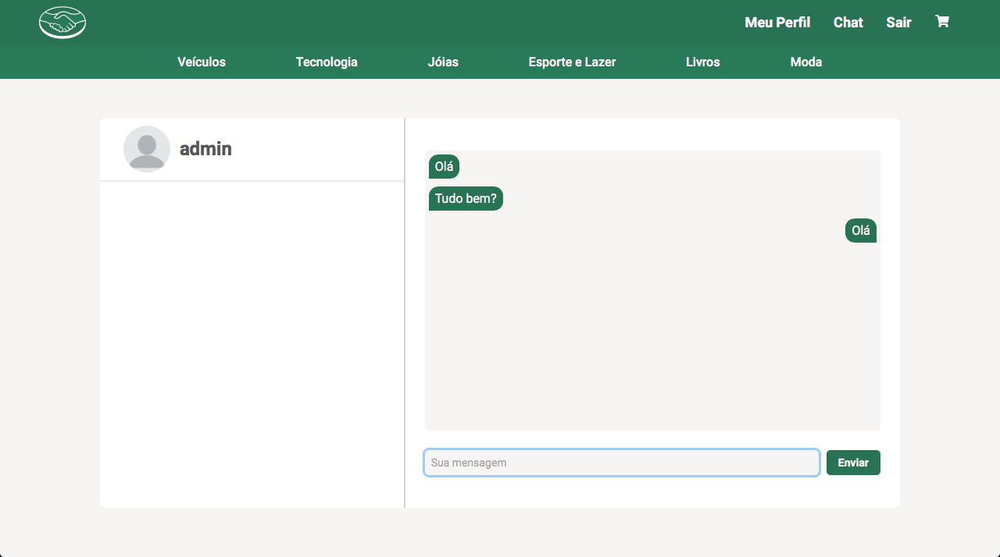
    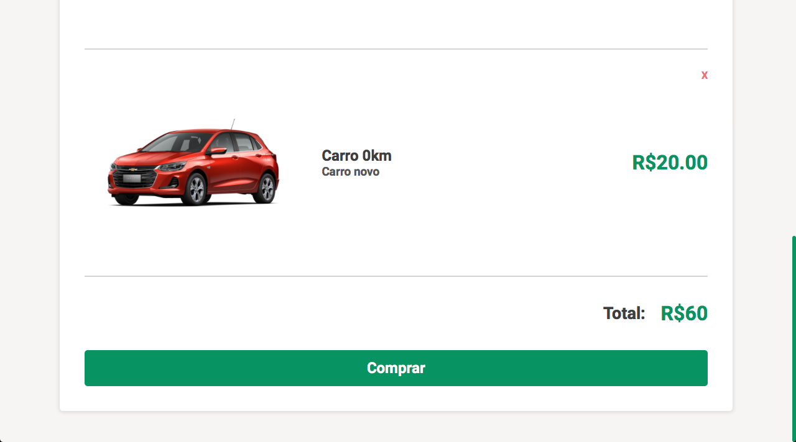
    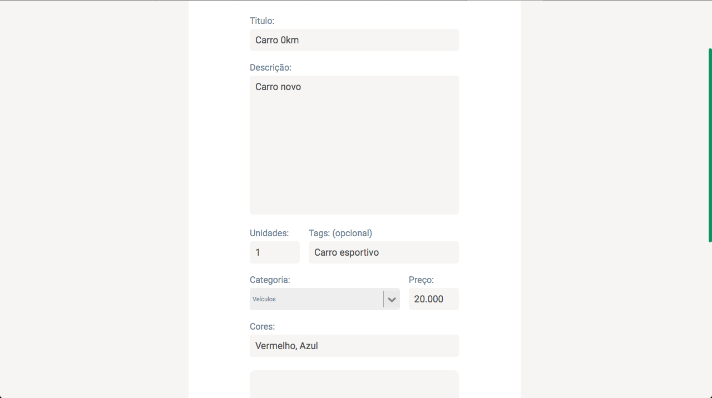
    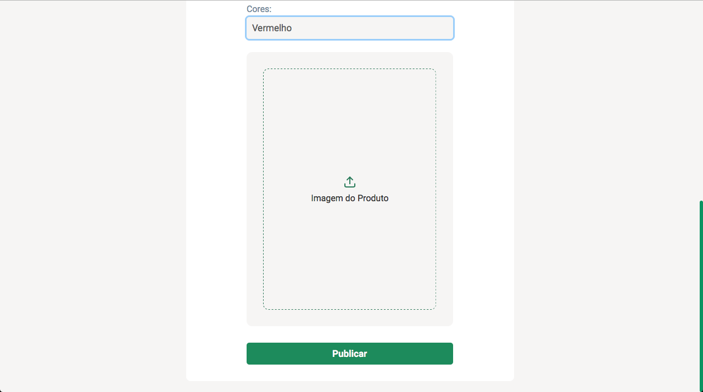
    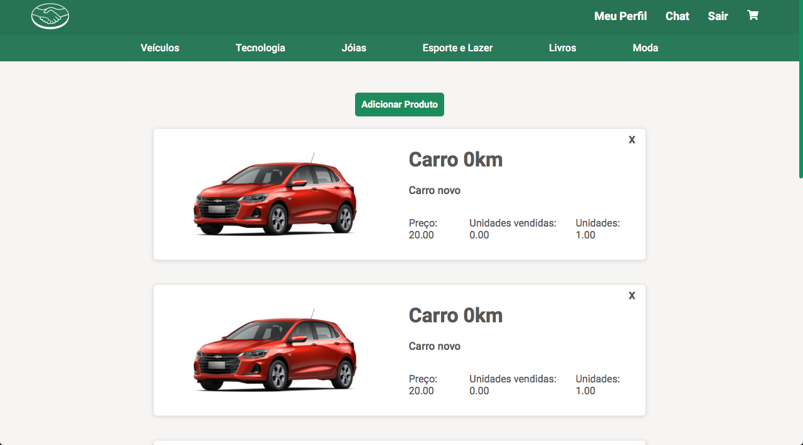
    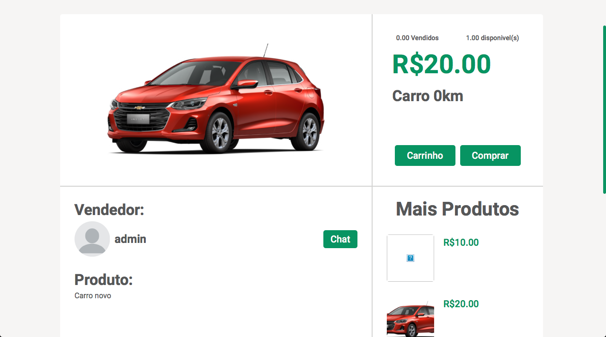
    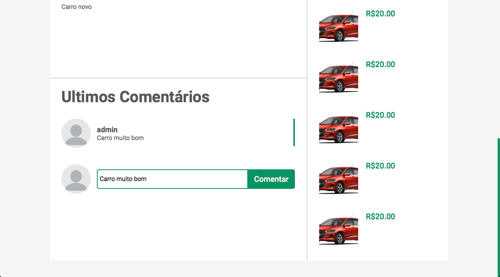
</h1>

# :eyes: Link Website
Você pode acessar o website em:   
👉  https://lojavirtuall.netlify.app

[](https://lojavirtuall.netlify.app)      


<a id="como-usar"></a>

# :construction_worker: Como Usar

### **Pré-requisitos**

  - Possuir o **[Node.js](https://nodejs.org/en/)** instalado na máquina
  - Ter um gerenciador de pacotes seja o **[NPM](https://www.npmjs.com/)** ou **[Yarn](https://yarnpkg.com/)**.

```bash
# Clone o Repositório
$ git clone https://github.com/PabloRSantos/MercadoLivre.git
```
### 📦 Executando API

```bash
# Entre na pasta server
$ cd MercadoLivre/server

# Instale as dependências
$ yarn install ou $ npm install

# Execute a aplicação
$ yarn dev $ npm run dev
```
Acesse a API em http://localhost:3333/

### 💻 Executando projeto web

```bash
# Entre na pasta web
$ cd MercadoLivre/web

# Instale as dependências
$ yarn install ou $ npm install

# Execute a aplicação
$ yarn start ou $ npm run start
```
Vá para http://localhost:3000/ para ver o resultado.

<a id="como-contribuir"></a>

## :recycle: Como contribuir

- Faça um Fork desse repositório,
- Crie uma branch com a sua feature: `git checkout -b my-feature`
- Commit suas mudanças: `git commit -m 'feat: My new feature'`
- Push a sua branch: `git push origin my-feature`


---

<h4 align="center">
    Feito com 💜 by <a href="https://www.linkedin.com/in/pablo-rosa-68136a1b2/" target="_blank">Pablo Rosa</a>
</h4>
